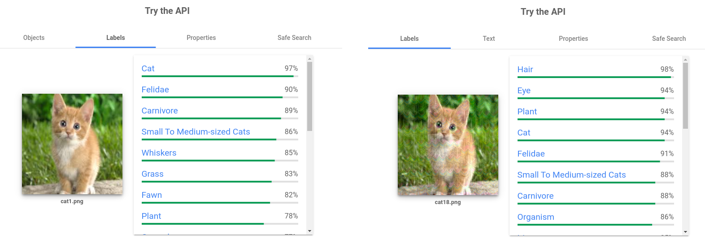

# Google Vision API fork
This fork tries to replicate the attack on Google Vision API from the paper, but for which the source code wasn't published.

### **Examples of successful untargeted attack**




# Black-Box Adversarial Attack with Transferable Model-based Embedding

This repository contains the code for reproducing the experimental results of attacking Imagenet dataset, of our submission: *Black-Box Adversarial Attack with Transferable Model-based Embedding*. 
https://openreview.net/forum?id=SJxhNTNYwB

## Requirements

Python packages: numpy, pytorch, torchvision.

The code is tested under Ubuntu 18.04, Python 3.7.1, PyTorch 1.1.0, NumPy 1.16.4, torchvision 0.3.0, CUDA 10.0 and cuDNN 7.4.2.

Please download the weight of the generator from https://drive.google.com/file/d/1IvqcYTnIjqPK7oZU-UnVzjfdxdtV63jk/view?usp=sharing and extract it in the root folder;

Please download the test images from https://drive.google.com/file/d/1Gs_Rw-BDwuEn5FcWigYP5ZM9StCufZdP/view?usp=sharing and extract it under [dataset/Imagenet](dataset/Imagenet)
## Reproducing the results

### Imagenet targeted attack:

For reproducing the result of attacking class 0 (tench), you can run the code using the 
The results can be reproduced using the following command:

```
python attack.py --device cuda:0 --config config/attack_target.json --model_name [VGG19|Resnet34| Densenet121|Mobilenet]
```
If you want to attack another class, please change in *target_class* and *generator_name* in the [config/attack_target.json](config/attack_target.json). Here is the list of the *target_class* and its corresponding *generator_name*

|  target_class   | generator_name  |
|  ----  | ----  |
| 20 (Dipper) | Imagenet\_VGG16_Resnet18\_Squeezenet\_Googlenet\_target\_20 |
| 40 (American chameleon) | Imagenet\_VGG16_Resnet18\_Squeezenet\_Googlenet\_target\_40 |
| 60 (Night snake) | Imagenet\_VGG16_Resnet18\_Squeezenet\_Googlenet\_target\_60 |
| 80 (Ruffed grouse) | Imagenet\_VGG16_Resnet18\_Squeezenet\_Googlenet\_target\_80 |
| 100 (Black swan) | Imagenet\_VGG16_Resnet18\_Squeezenet\_Googlenet\_target\_100 |

### Imagenet un-targeted attack:

For reproducing the result of un-targeted, you can run the code using the 
The results can be reproduced using the following command:

```
python attack.py --device cuda:0 --config config/attack_untarget.json --model_name [VGG19|Resnet34|Densenet121|Mobilenet]
```

### Attack defense model:

Please download the weight of the Imagenet model from https://drive.google.com/file/d/1nNRhzijZnHjHJ6SkFVTaFxDO-YnxiAhZ/view?usp=sharing and extract it in the root folder;

For reproducing the result of attacking defense model, you can run the code using the 
The results can be reproduced using the following comman
d:

```
python attack.py --device cuda:0 --config [config/attack_defense_untarget.json|config/attack_defense_OSP_untarget.json] 
```


About the attack algorithm, `config/attack_defense_untarget.json` corresponds to TREMBA and `config/attack_defense_OSP_untarget.json` corresponds to TREMBA$_{OSP}$.

The result in store in the output folder with npy format recording the queries need to attack each image. The image with query larger than 50000 means the attack is failed.
 
 
### Training the Generator

Please download the train images from https://drive.google.com/file/d/1R_aC1onf0Yv77cL0OHjJ2VeXjrIbgKXb/view?usp=sharing and extract it under [dataset/Imagenet](dataset/Imagenet)

We need two gpus to train the generator for un-targeted and targeted attack, four gpus to train the generator for attacking defense model.

For training the generator for un-targeted and targeted attack, the command is 

```
python train_generator.py --config [config/train_untarget.json|config/train_target.json] --device 0 1
```

`config/train_untarget.json` corresponds the generator for un-targeted attack and `config/train_target.json` corresponds the generator for un-targeted attack. You may change to `target_class` in `config/train_target.json` to train the generator for attacking different class.

For training the generator for the defened network, the command is 

```
python train_generator.py --config config/train_defense_untarget.json --device 0 1 2 3
```

The weight for generator will be stored in [G_weight](G_weight)

### Citation

```
@inproceedings{Huang2020Black-Box,
    title={Black-Box Adversarial Attack with Transferable Model-based Embedding},
    author={Zhichao Huang and Tong Zhang},
    booktitle={International Conference on Learning Representations},
    year={2020},
    url={https://openreview.net/forum?id=SJxhNTNYwB}
}
```
